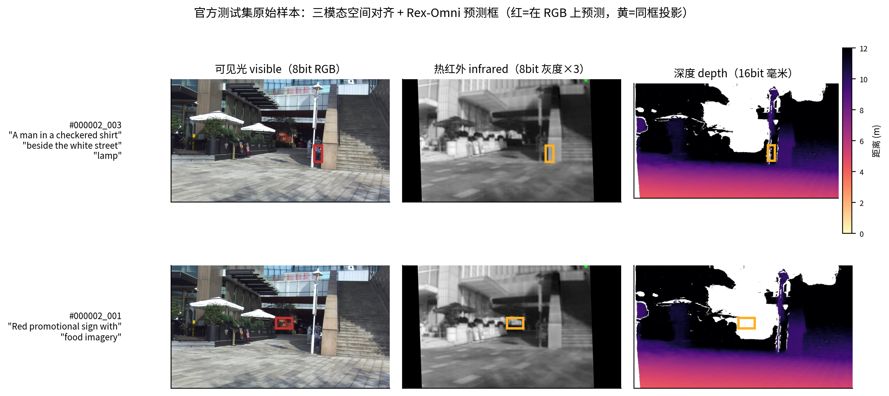

# 多模态视觉定位 · 工程报告

> 本文是项目工程视角的复盘——赛题数据什么样？尝试了哪些方案？最终用了什么？为什么？
> 详细实验日志见 [`experiments_log.md`](experiments_log.md)，版本化复盘见 [`summary.md`](summary.md)。

---

## 1. 赛题

### 1.1 任务定义

**多模态视觉定位**（Visual Grounding / Referring Expression Comprehension, REC）：

- **输入**：RGB 图像 + Depth 深度图 + Infrared 红外图 + 一句英文指代 Query
- **输出**：目标在 RGB 图像坐标系中的归一化 bbox `[x1, y1, x2, y2]`（值域 [0,1]）
- **指标**：ACC@0.5——预测框与 GT 的 IoU ≥ 0.5 即正确
- **数据规模**：初赛 9555 条 / 复赛 5690 条（不同测试集，**不可直接比较**）

### 1.2 关键约束（决定方案设计空间）

| 约束 | 影响 |
|---|---|
| **官方测试集无 bbox** | 不能训练、不能伪标签、不能用平台分做模型选择 |
| **仅开源模型** | 排除商业闭源 API（如 GPT-4o） |
| **允许任意外部公开数据训练** | RefCOCO / SUN RGB-D / LLVIP / RGBDT500 可用 |
| **三视觉模态** | 必须解决 RGB+D+IR 融合的工程问题 |

> 任务契约全文：[`work.md`](work.md)

### 1.3 数据样例与特点

#### Query 风格

官方 query 是**人工指代句**，中位 9 词，覆盖：

| 类型 | 示例 |
|---|---|
| 外观描述 | "the black cat on the sofa" |
| 位置指代 | "the leftmost security camera on the second floor" |
| 关系指代 | "the person next to the red car" |
| 序数 | "the second stone pier from left" |
| 行为状态 | "the person walking away" |

复赛 query 风格统计（项目实测）：颜色 44.3%、最高级 ~10%、序数 ~8%。

#### 三模态图像特点

| 模态 | 通道 | 取值范围 | 特点 |
|---|---|---|---|
| RGB | 3×8-bit | [0, 255] | 标准彩色 |
| Depth | 1×16-bit | [0, 65535] mm | 0 = 无效；有效范围 ~300~20000 mm；很多区域无深度 |
| IR (Infrared) | 3×8-bit | [0, 255] | 三通道冗余堆叠（伪彩），本质是灰度热辐射图 |

20.3% 的官方 query 含**深度/红外敏感线索**（远近 10.0% / 遮挡 4.6% / 暗光 4.3% / 温度 2.7%）——但实测融合提升有限，详见 §3.5。

#### 真实样本可视化



*官方测试集样本（#000002_001 / #000002_003）：左列 RGB / 中列热红外（IR）/ 右列深度（Depth，紫=远/黄=近）。红框 = Rex-Omni 在 RGB 上的预测，黄框 = 同位置投影到 IR/Depth。*

观察：
- RGB 与 IR **空间对齐**良好（同一相机视角），融合时可直接做像素级融合
- Depth 大量黑色区域表示**深度缺失**（远距离 / 镜面 / 天空）——不可简单对齐到 RGB
- Rex-Omni 预测框即使在没有明显 Depth 证据的区域（天空、墙面）也能正确锚定

---

## 2. 方案演进

### 2.1 时间线（分数演进）

```
平台分：
0.43  ──►  0.45  ──►  0.12  ──►  0.6926  ──►  0.6984  ──►  0.68  ──►  0.708
 │         │         │           │            │           │         │
 Qwen3-VL  Hybrid   自研       Rex-Omni    + MTLA     SFT-v2   后训练
 (基线)    保守     定位器       零样本       低置信回退   续训     主提交
                                          (项目最高)
```

### 2.2 阶段一：通用 VLM 直出（2026-07-25）

**方案**：Qwen3-VL-8B 直接用文本生成坐标。

```python
# 伪代码
prompt = f"Locate '{query}' in the image. Output [x1,y1,x2,y2] in [0,1]."
output = qwen3_vl.generate(image, prompt)
bbox = parse_xyxy(output)  # 解析 LLM 输出的数字
```

**效果**：**0.43**（平台实测）

**问题**：LLM 当"出文本"模型，几何精度在 token 量化中损失——预测框中位宽高 `0.10×0.175`，75% 框面积 < 0.05。

### 2.3 阶段二：GDINO 候选 + hybrid（2026-07-25）

**方案**：Qwen3-VL 主预测 + Grounding DINO 候选保守融合。

```python
qwen_bbox = qwen3_vl.predict(image, query)
gdino_bbox = gdino(image, query)  # 仅 RGB
if iou(qwen_bbox, gdino_bbox) >= 0.3 and gdino_score >= 0.25:
    bbox = (qwen_bbox + gdino_bbox) / 2  # 保守融合
else:
    bbox = qwen_bbox
```

**效果**：**0.45**（+0.02，21.7% 样本触发融合）

**问题**：仍只用 RGB，Depth/IR 信息未使用；GDINO 框更大（本数据集目标小，过预测扣分）。

### 2.4 阶段三：自研定位器（2026-07-25 ~ 08-21）—— 失败

**方案**：DINOv2 + Qwen 语义 + Cross-Attention Decoder + BBox Head。
**数据**：RefCOCO（~308K）+ SUN RGB-D（18.6K）+ LLVIP（34.1K）+ RGBDT500（3.1K）。

**公开验证**：RefCOCO val ACC@0.5 = **0.8986**（专家级）
**官方实测**：**0.1081 / 0.1237**（远低于 hybrid 0.45）

**教训**（最重要的一条）：
> **公开验证高分 ≠ 官方有效。RefCOCO 室内英文 query 与官方真实采集域（街景/校园/动物园）分布差异巨大。**
> 所有后续方案**必须平台实测超过 0.45 才能替换主提交**。

### 2.5 阶段四：Rex-Omni 强基座（2026-08-25+）—— 转折点

**关键发现**：[Rex-Omni](https://arxiv.org/abs/2510.12798)（IDEA Research，3B 模型，22M 监督 SFT+GRPO，专门在 grounding / 检测 / 指代 / 视觉提示等任务训练过）的零样本 ACC@0.5 直接打到 **0.6926**。

**为什么 Rex-Omni 这么强**：

| 维度 | Rex-Omni-3B | Qwen3-VL-8B |
|---|---|---|
| 模型规模 | 3B | 8B |
| 训练域 | 22M 接地数据 | 通用图文 |
| 任务 | 专精 grounding | 通用 VQA |
| **官方域 ACC** | **0.6926** | **0.43** |

**核心结论**：**专门检测训练 × 数据域匹配 > 模型规模**——找对基座比自训更重要。

### 2.6 阶段五：MTLA 推理侧改进（2026-09+）—— 历史最高

[MTLA（Propose and Attend，Amazon）](https://github.com/TalRemez/MTLA.git) 通过读 MLLM 生成 token 时的注意力，区分"有根据的预测"和"幻觉预测"：

```python
# MTLA 三层聚合
LA(q) = sum of attention from q to visual tokens in box
MTLA(p) = mean over generation tokens Q_p
s(p) = mean over (layers 8-22, all heads)
```

**项目应用**：低置信 P25 样本回退零样本推理 → **0.6984**（项目历史最高，零训练）。

### 2.7 阶段六：SFT 后训练（复赛阶段）

合成数据引擎 + SFT 续训：

| 数据版本 | 规模 | 平台分 |
|---|---|---|
| v2（detect/ordinal/relation/attribute/referring）| 183K | **0.68**（+0.02） |
| v4（+VG/VLM-rewrite/LVIS）| 291K | RGBDT500 0.7875→0.8125 |
| v5（v4 审计清洗 -10.6%）| 260K | GRPO 待出 |

**关键发现**：边际数据质量 > 数量——v4 vs v2 对照，78.5% 框改变但 90% 是精修（IoU 中位 0.973），仅 273 条换目标。

### 2.8 最终主提交

复赛主提交 = **Rex-Omni 后训练权重**，平台分 **0.708**（自 hybrid 0.45 起步，**+0.258 提升 57%**）。

---

## 3. 关键技术详解

### 3.1 Rex-Omni 坐标 token 机制

把 bbox 坐标变成词表 token：

```
<N>, N ∈ [0,999]  →  id = 150643 + N
<|box_start|>:  id 151648
<|box_end|>:    id 151649

x_norm ∈ [0,1]  →  N = round(x_norm × 999)  (精度 1/999 ≈ 0.1%)
```

**复用 Qwen2.5-VL 的 next-token CE 框架**——不需要额外回归头，坐标 token 与文本 token 在同一序列里做 attention。

**工程要点**（项目踩坑）：
- 必须 `use_fast=False`（fast tokenizer 对扩展 token 处理不一致）
- transformers 4.51.3 可用，5.x 不兼容
- 加载后必须验证关键 token id（`assert tokenizer.encode("<0>")[-1] == 151643`）

详见 [`../learning/01_grounding_models.md`](../learning/01_grounding_models.md)。

### 3.2 Grounding DINO 候选检测器

Grounding DINO（IDEA Research）是开放集检测基础：

```
输入：RGB + 文本 query（如 "car"）
   ↓
Swin Backbone（图像编码）+ BERT（文本编码）
   ↓
双向跨模态注意力（每层都做 image↔text CA）
   ↓
输出：候选框 + 文本匹配分数
```

**项目用法**：作为**候选生成器**（top-K=10 候选，Recall@10=0.975），不直接当主决策器（GDINO 零样本官方域仅 0.39）。

详见 [`../learning/01_grounding_models.md §3`](../learning/01_grounding_models.md)。

### 3.3 MTLA 训练免费的置信度

**核心洞察**：MLLM 在 grounding 数据上学过"看图找框"——它的注意力天然有 grounding 信号，免费可用。

**三层聚合**：
1. **Localized Attention**：每个生成 token 对预测框内视觉 token 的注意力之和
2. **Multi-Token 聚合**：跨生成 token 求平均（去噪声）
3. **层/头归约**：对中间层（默认 8-22）所有头取平均

```python
# 项目实现：monkey-patch Qwen2_5_VLAttention.forward
def patched_forward(self, hidden_states, ...):
    kwargs["output_attentions"] = True
    output = original_forward(self, hidden_states, ...)
    if output[1] is not None:
        attn = output[1]
        if attn.shape[-2] == 1:  # decode 步
            output[1] = attn[0, :, -1:, :]  # 只保留 [heads, kv_len]
        else:
            output[1] = None
    return output
```

**RefCOCO val 区分度**（项目实测）：Q1 低置信 0.667 vs Q4 高置信 0.960——**差 29pp**。

**项目应用**：低置信 P25 回退零样本 → **0.6984**。

**作用边界**（重要！）：
- ✅ **能**：排序预测质量、低置信回退
- ❌ **不能**：重生成仲裁（crop-zoom 后 MTLA 分数与质量不单调相关）

详见 [`../learning/04_confidence_attention.md`](../learning/04_confidence_attention.md) + [`utils/rexomni_vision_attn.py`](../utils/rexomni_vision_attn.py)。

### 3.4 多模态融合：4 次证伪的教训

**尝试过的融合方案**（Thermo-VL 路线主复现）：

```
Stage 1: 文本引导双注意力
  T_txt = MHA(T, P, P)  # 热 token 注意文本
  T_rgb = MHA(T, R, R)  # 热 token 注意 RGB

Stage 2: 融合更新
  T_hat = LN(T + MLP([T_bar; T_txt; T_rgb]))

Stage 3: 残差预测
  ΔR = MLP_r(T_hat)

Stage 4: 门控注入
  α = σ(MLP_g([R_bar; T_hat]))
  R† = R + α ⊙ ΔR
```

**实测平台分**：

| 变体 | 平台分 |
|---|---|
| 纯零样本（基线） | **0.6926** |
| 全强度注入（gate 饱和 1.0） | 0.6545 |
| 温和注入（GATE_MAX=0.3） | 0.686 |
| + LoRA + MDETR | 0.6311 |

**单调性**：注入强度从无 → 温和 → 全 → +LoRA，**分数单调下降**——**任何注入都是干扰**。

**三个根因**：
1. **gate 饱和**：sigmoid 梯度消失 + 熵正则自我失效
2. **$L_{align}$ 自我满足**：R† ≈ T 后 MSE ≈ 0 → aux loss 全消失
3. **公开数据验证不迁移官方域**：RGBDT500 互补性 +0.026 在官方域全失效

**推论**：注入式融合 + 冻结 LLM 是**范式级限制**，不是参数问题。

### 3.5 SFT 数据引擎与质量审计

**池演进**：

| 版本 | 规模 | 构成 |
|---|---|---|
| v2 | 183K | detect 15k / ordinal 55k / relation 43k / attribute 59k / referring 10k |
| v4 | 291K | +VG 人工指代 70k / VG 关系 45k / LLVIP 40k / VLM 改写长句 37k |
| v5 | 260K | v4 审计清洗 −10.6%（剩余：关系标签重算唯一性）|

**质量审计**（分层抽样 16 例）：

| 来源 | 问题率 | 问题性质 |
|---|---|---|
| vg_desc | 0% | **最干净**（主力保留）|
| coco_attr | ~67% | 系统性缺陷（HSV 对全框判色，背景参与投票）|
| vg_rel | ~67% | 关系无区分度（"under the sky"对万物成立）|
| lvis | ~33% | 极小目标不可验证 |
| vlm_rewrite | ~25% | 属性幻觉 |

**纪律**：合成数据的最大风险**不是量不够，而是"标注系统性错"**——程序化规则会把手法的缺陷放大成数据集级偏差。

### 3.6 工程铁律（10 条）

```
1. 训练必须验证"权重真的变了"（权重指纹）
2. optimizer 参数数量打印是启动必备
3. from_pretrained + restore_stem_fp32 后必须重新调 _reset_new_modules()
4. 推理脚本必须与训练脚本同一装配流程（from_pretrained → restore → reset → enable_lora → load）
5. enable_lora(rank 必须与训练一致) + 打印 missing/unexpected 统计
6. 第三方模型的"坐标空间"必须与模型实际输入一致（用 image_grid_thw 反推）
7. 归因前先排除使用 bug（"模型能力不行"在契约对齐后再下）
8. 文本模型 tokenizer 有特殊字符敏感（用完整句子喂"类别型"检测器违背设计）
9. 熵正则"防饱和"在饱和点自我失效——依赖正则不如硬约束物理量
10. 后台任务管理要查进程数/产物完整性，不是看日志 tail
```

---

## 4. 效果与对比

### 4.1 主线分数演进

| 阶段 | 方案 | 平台分 | 提升 |
|---|---|---|---|
| 基线 | Qwen3-VL-8B 直出 | 0.43 | — |
| Hybrid | + GDINO 保守融合 | 0.45 | +0.02 |
| 自研定位器 | DINOv2 + Qwen + Decoder | 0.12 | **失败** |
| **强基座** | **Rex-Omni-3B 零样本** | **0.6926** | **+0.2626** |
| **+ MTLA** | **+ 低置信回退** | **0.6984** | **+0.0058**（零训练）|
| SFT-v2 | 续训（183k 官方风格）| 0.68 | -0.01（微调正向）|
| SFT-v4 | RGBDT500 验证 | 0.7875→0.8125 | +0.025 |
| **最终** | **后训练权重主提交** | **0.708** | **+0.258** |

### 4.2 与主流方法对比

| 方法 | 是否需要训练 | 平台分 | 备注 |
|---|---|---|---|
| Qwen3-VL-8B 直出 | ❌ | 0.43 | 基线 |
| 自研 DINOv2 + Decoder | ✅ | 0.12 | 域迁移失败 |
| Grounding DINO 零样本 | ❌ | 0.39 | 仅 RGB，定位粗 |
| Rex-Omni-3B 零样本 | ❌ | 0.6926 | **首选基座** |
| Rex-Omni + MTLA | ❌ | 0.6984 | **零训练提升** |
| Rex-Omni + SFT（项目）| ✅ | 0.708 | **最终主提交** |
| Rex-Thinker CoT（项目实测）| ❌ | 0.666 | 训练域不匹配，否决 |

### 4.3 公开域 sanity（不外推）

| 数据集 | ACC@0.5 | 备注 |
|---|---|---|
| RefCOCO val | 0.7875 → 0.8125（SFT-v4）| 公开域，**不外推官方域** |
| RGBDT500 val | 0.7875 → 0.8125（SFT-v4）| 唯一三模态齐全 |
| LLVIP | 0.0013（自研）| 类名 query 歧义 |

### 4.4 评测范围声明

- 平台分仅在该竞赛初赛 / 复赛测试集上有效
- 公开验证集（RefCOCO / RGBDT500 / LLVIP）query 风格与官方不同，**结论不外推官方域**
- 单模型 / 单次推理的数字均带随机性，论文级评测通常报告均值 ± 方差
- **本评测不构成对各方法的充分测评**

---

## 5. 关键经验教训

1. **专门基座 > 自研微调** —— Rex-Omni-3B（22M SFT）零样本 > 所有自研
2. **推理侧改进 > 微调**（官方域无标注时）—— MTLA 零训练 > 所有 LoRA / 融合
3. **公开数据验证不迁移官方域** —— 唯一真值是平台分（多次证伪）
4. **训练分布与目标分布的距离**决定微调成败
5. **模型输入契约必须逐字对齐**（Rex-Thinker 两次栽在"使用方式没对齐"）
6. **数据质量 > 数据数量**（程序化规则会放大缺陷）
7. **工程铁律**比模型设计更重要（optimizer 参数打印、权重指纹、装配一致性）
8. **不要假设更大的 bbox 更好** —— 本数据集目标较小，过预测反而扣分
9. **能力解耦原则** —— 视觉组件与语义组件可分阶段训练后组装
10. **GDINO 排序 vs 定位可分离** —— top-5 oracle 0.94 表明定位能力达标，缺的是文本-区域排序监督

---

## 6. 下一步（未走完路线）

按投入产出排序：

1. **CoT 数据引擎**：GDINO 类别词候选 + 程序化轨迹 + Qwen3-VL 组句 → CoT-SFT → CoT-GRPO（基座：在 Rex-Omni 权重上做，不换 Rex-Thinker）
2. **MTLA 低置信回退重开**：Rex-Thinker hint 坐标 bug 已实锤修复，可重新评估"MTLA 仲裁 + Rex-Thinker 重推理"
3. **SFT-v4 / GRPO 平台分确认**
4. **多模态融合的非注入路线**：伪 RGB 翻译、晚期 Box 融合（仅在证据反转时重启）

---

## 附录：完整目录结构

```
LLM/
├── README.md                          # GitHub 主页（项目介绍 + 关键数字）
├── requirements.txt
├── configs/                           # 训练与推理配置
├── scripts/                           # 训练、推理、数据构建脚本
├── models/                            # 模型定义
├── engine/                            # 训练引擎
├── data/                              # 数据集加载与预处理
├── utils/                             # 工具（含 MTLA 提取）
├── reference/MTLA/                    # Propose and Attend 官方实现
├── tests/
├── docs/
│   ├── project_report.md              # 本文档
│   ├── work.md                        # 官方规则
│   ├── experiments_log.md             # 实验日志
│   ├── summary.md                     # 版本化复盘
│   ├── improvement_ideas_classified.md
│   ├── tech_share_presentation.pdf    # 技术分享 PPT
│   └── learning/                      # 7 册方法论笔记
└── slides/                            # 比赛复盘 PPT（理性归因风格）
```

#multimodal #grounding #MLLM #project-report